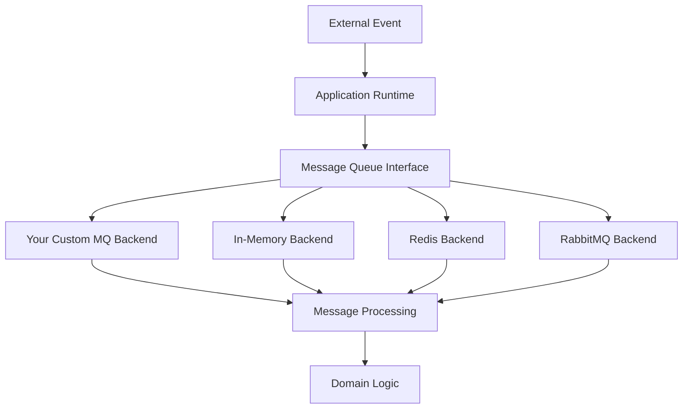

# API References

This section provides detailed documentation for implementing and extending message queue components for the Abstract Backend runtime. The message queue system enables flexible event processing through pluggable backend implementations that can be tailored to any application.

## Overview

The Abstract Backend runtime supports a flexible message queue architecture that allows teams to:

- **Extend existing backends**: Implement custom message queue backends using the `MessageQueueBackend` protocol
- **Plugin architecture**: Install message queue components via `pip install <abstract-backend-mq-plugin>`
- **Environment-based configuration**: Configure message queue backends using environment variables
- **Seamless integration**: Drop-in connectivity with your application runtime

## Architecture Design

### Core Components



### Plugin Discovery System

Abstract Backend uses Python's entry points system to automatically discover and load message queue backends:

```toml
[project.entry-points."abe.backends.message_queue.service"]
your_backend_name = "your_package.module:YourBackendClass"
```

## MessageQueueBackend Protocol

### Interface Definition

All message queue backends must implement the `MessageQueueBackend` protocol:

```python
from typing import Any, AsyncIterator, Dict, Optional, Protocol


class MessageQueueBackend(Protocol):
    """Protocol defining the interface for message queue backends."""
    
    @classmethod
    def from_env(cls) -> "MessageQueueBackend":
        """Create backend instance from environment variables."""
        ...
    
    async def publish(self, key: str, payload: Dict[str, Any]) -> None:
        """Publish a message to the queue."""
        ...
    
    async def consume(self, *, group: Optional[str] = None) -> AsyncIterator[Dict[str, Any]]:
        """Consume messages from the queue."""
        ...
```

### Method Details

#### `from_env()` Class Method

**Purpose**: Creates a backend instance configured from environment variables.

**Parameters**: None

**Returns**: An instance of your backend class

**Implementation Requirements**:
- Read configuration from environment variables
- Validate required configuration
- Return a properly configured instance
- Handle missing or invalid configuration gracefully

**Example**:
```python
@classmethod
def from_env(cls) -> "YourBackend":
    import os
    
    host = os.getenv("MQ_HOST", "localhost")
    port = int(os.getenv("MQ_PORT", "5672"))
    username = os.getenv("MQ_USERNAME")
    password = os.getenv("MQ_PASSWORD")
    
    if not username or not password:
        raise ValueError("MQ_USERNAME and MQ_PASSWORD are required")
    
    return cls(host=host, port=port, username=username, password=password)
```

#### `publish()` Method

**Purpose**: Publishes a message to the message queue.

**Parameters**:
- `key` (str): Routing key or topic for the message
- `payload` (Dict[str, Any]): Message data as a dictionary

**Returns**: None

**Implementation Requirements**:
- Handle connection errors gracefully
- Ensure message persistence if required
- Support routing based on the key parameter
- Log errors appropriately

**Example**:
```python
async def publish(self, key: str, payload: Dict[str, Any]) -> None:
    try:
        # Convert payload to JSON
        message = json.dumps(payload)
        
        # Publish to your message queue
        await self._connection.publish(
            exchange="application_events",
            routing_key=key,
            body=message,
            properties={"delivery_mode": 2}  # Persistent
        )
        
        logger.info(f"Published message with key: {key}")
    except Exception as e:
        logger.error(f"Failed to publish message: {e}")
        raise
```

#### `consume()` Method

**Purpose**: Consumes messages from the message queue.

**Parameters**:
- `group` (Optional[str]): Consumer group for load balancing (if supported)

**Returns**: AsyncIterator[Dict[str, Any]] - An async iterator yielding message payloads

**Implementation Requirements**:
- Yield messages as they arrive
- Handle consumer group semantics if supported
- Gracefully handle connection interruptions
- Support cancellation via asyncio

**Example**:
```python
async def consume(self, *, group: Optional[str] = None) -> AsyncIterator[Dict[str, Any]]:
    queue_name = f"application_events_{group}" if group else "application_events"
    
    try:
        async with self._connection.consume(queue_name) as consumer:
            async for message in consumer:
                try:
                    payload = json.loads(message.body)
                    yield payload
                    await message.ack()
                except json.JSONDecodeError:
                    logger.error(f"Invalid JSON in message: {message.body}")
                    await message.nack()
    except asyncio.CancelledError:
        logger.info("Consumer cancelled, shutting down gracefully")
        raise
```

## Implementation Guide

### Step 1: Create Your Backend Class

Create a new Python package with your backend implementation:

```python
# your_package/backends/your_backend.py
import asyncio
import json
import logging
from typing import Any, AsyncIterator, Dict, Optional

from abe.backends.message_queue.base.protocol import MessageQueueBackend

logger = logging.getLogger(__name__)


class YourMQBackend(MessageQueueBackend):
    """Your custom message queue backend implementation."""

    def __init__(self, host: str, port: int, username: str, password: str):
        self.host = host
        self.port = port
        self.username = username
        self.password = password
        self._connection = None

    @classmethod
    def from_env(cls) -> "YourMQBackend":
        """Create instance from environment variables."""
        # Implementation here
        pass

    async def connect(self):
        """Establish connection to your message queue."""
        # Implementation here
        pass

    async def disconnect(self):
        """Close connection to your message queue."""
        # Implementation here
        pass

    async def publish(self, key: str, payload: Dict[str, Any]) -> None:
        """Publish message implementation."""
        # Implementation here
        pass

    async def consume(self, *, group: Optional[str] = None) -> AsyncIterator[Dict[str, Any]]:
        """Consume messages implementation."""
        # Implementation here
        pass
```

### Step 2: Configure Entry Points

Add the entry point to your `pyproject.toml`:

```toml
[project.entry-points."abe.backends.message_queue.service"]
your_backend = "your_package.backends.your_backend:YourMQBackend"
```

### Step 3: Environment Configuration

Document the required environment variables for your backend:

```bash
# Your backend configuration
export MESSAGE_QUEUE_BACKEND="your_backend"
export MESSAGE_QUEUE_HOST="localhost"
export MESSAGE_QUEUE_PORT="5672"
export MESSAGE_QUEUE_USERNAME="user"
export MESSAGE_QUEUE_PASSWORD="password"
export MESSAGE_QUEUE_VHOST="/"
export MESSAGE_QUEUE_EXCHANGE="application_events"
```

### Step 4: Error Handling Best Practices

Implement robust error handling:

```python
import asyncio
from contextlib import asynccontextmanager


class YourMQBackend(MessageQueueBackend):
    async def __aenter__(self):
        """Async context manager entry."""
        await self.connect()
        return self
    
    async def __aexit__(self, exc_type, exc_val, exc_tb):
        """Async context manager exit."""
        await self.disconnect()
    
    @asynccontextmanager
    async def _handle_connection_errors(self):
        """Handle connection errors with retry logic."""
        max_retries = 3
        retry_delay = 5
        
        for attempt in range(max_retries):
            try:
                yield
                break
            except ConnectionError as e:
                if attempt == max_retries - 1:
                    raise
                logger.warning(f"Connection failed, retrying in {retry_delay}s: {e}")
                await asyncio.sleep(retry_delay)
```

## Testing Your Implementation

### Unit Testing

Create comprehensive tests for your backend:

```python
import pytest
import asyncio
from unittest.mock import AsyncMock, MagicMock

from your_package.backends.your_backend import YourMQBackend

class TestYourMQBackend:
    @pytest.fixture
    async def backend(self):
        backend = YourMQBackend(
            host="localhost",
            port=5672,
            username="test",
            password="test"
        )
        await backend.connect()
        yield backend
        await backend.disconnect()
    
    async def test_publish(self, backend):
        """Test message publishing."""
        payload = {"event": "message", "data": {"text": "Hello"}}
        await backend.publish("test.key", payload)
        # Add assertions based on your implementation
    
    async def test_consume(self, backend):
        """Test message consumption."""
        messages = []
        async for message in backend.consume():
            messages.append(message)
            if len(messages) >= 1:
                break
        
        assert len(messages) == 1
        # Add more assertions
```

### Integration Testing

Test integration with your application runtime:

```python
import os
import pytest
from abe.backends import get_message_queue_backend


@pytest.mark.integration
async def test_backend_integration():
    """Test backend integration with the application runtime."""
    os.environ["MESSAGE_QUEUE_BACKEND"] = "your_backend"
    os.environ["MESSAGE_QUEUE_HOST"] = "localhost"
    # Set other required env vars

    backend = get_message_queue_backend()
    assert isinstance(backend, YourMQBackend)

    # Test publish/consume cycle
    test_payload = {"event": "app_mention", "data": {"text": "test"}}
    await backend.publish("application.event", test_payload)

    async for message in backend.consume():
        assert message == test_payload
        break
```

## Common Patterns and Examples

### Pattern 1: Connection Pooling

For backends that support connection pooling:

```python
class PooledMQBackend(MessageQueueBackend):
    def __init__(self, pool_size: int = 10):
        self.pool_size = pool_size
        self._pool = None
    
    async def connect(self):
        self._pool = await create_connection_pool(
            size=self.pool_size,
            host=self.host,
            port=self.port
        )
    
    async def publish(self, key: str, payload: Dict[str, Any]) -> None:
        async with self._pool.acquire() as conn:
            await conn.publish(key, payload)
```

### Pattern 2: Message Serialization

Custom serialization for complex payloads:

```python
import pickle
import base64


class SerializingMQBackend(MessageQueueBackend):
    def _serialize(self, payload: Dict[str, Any]) -> str:
        """Serialize payload to string."""
        pickled = pickle.dumps(payload)
        return base64.b64encode(pickled).decode('utf-8')
    
    def _deserialize(self, data: str) -> Dict[str, Any]:
        """Deserialize string to payload."""
        pickled = base64.b64decode(data.encode('utf-8'))
        return pickle.loads(pickled)
```

### Pattern 3: Dead Letter Queues

Handle failed message processing:

```python
class DLQSupportedBackend(MessageQueueBackend):
    async def consume(self, *, group: Optional[str] = None) -> AsyncIterator[Dict[str, Any]]:
        max_retries = 3
        
        async for message in self._consume_raw():
            retry_count = message.headers.get('retry_count', 0)
            
            try:
                yield self._deserialize(message.body)
                await message.ack()
            except Exception as e:
                if retry_count >= max_retries:
                    # Send to dead letter queue
                    await self._send_to_dlq(message, str(e))
                    await message.ack()
                else:
                    # Retry
                    await self._retry_message(message, retry_count + 1)
                    await message.nack()
```

## Deployment and Distribution

### Package Structure

Recommended package structure:

```
your-mq-backend/
├── pyproject.toml
├── README.md
├── src/
│   └── your_package/
│       ├── __init__.py
│       └── backends/
│           ├── __init__.py
│           └── your_backend.py
├── tests/
│   ├── __init__.py
│   ├── test_backend.py
│   └── test_integration.py
└── docs/
    └── configuration.md
```

### Publishing to PyPI

1. Build your package:
```bash
python -m build
```

2. Upload to PyPI:
```bash
python -m twine upload dist/*
```

3. Users can then install:
```bash
pip install your-message-queue-backend
```

## Troubleshooting

### Common Issues

1. **Backend Not Found**
   - Verify entry point configuration in `pyproject.toml`
   - Ensure package is installed in the same environment as your application runtime

2. **Connection Errors**
   - Check network connectivity
   - Verify credentials and permissions
   - Implement proper retry logic

3. **Message Loss**
   - Ensure proper acknowledgment handling
   - Implement message persistence if required
   - Use transactions for critical operations

4. **Performance Issues**
   - Implement connection pooling
   - Use async/await properly
   - Consider message batching for high throughput

### Debugging

Enable debug logging:

```python
import logging

logging.basicConfig(level=logging.DEBUG)
logger = logging.getLogger("your_package.backends")
```

Use environment variables for debugging:

```bash
export ABSTRACT_BACKEND_DEBUG=true
export MESSAGE_QUEUE_BACKEND_DEBUG=true
```

## Reference Implementation

See the included memory backend (`src/memory.py`) for a complete reference implementation that demonstrates all required patterns and best practices.
